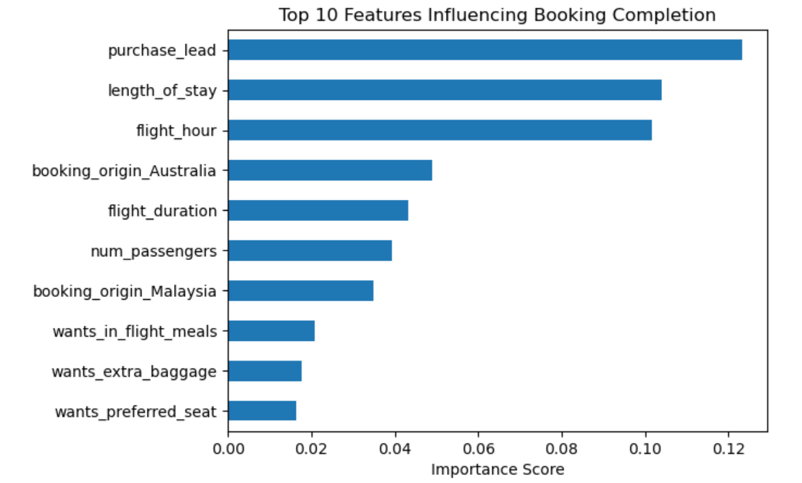

# ✈️ Predicting Customer Booking Behaviour – British Airways

## Project Overview
This project analyses historical customer booking data from British Airways to predict whether a customer will complete a flight booking.  
The objective is to identify the key drivers influencing booking behaviour and demonstrate how data-driven insights can support proactive decision-making.

This project was completed as part of the **British Airways Data Science Virtual Experience (Forage)**.

---

## Objective
- Predict whether a customer will complete a booking
- Identify the most influential factors affecting booking completion
- Present insights in a clear, business-focused manner

---

## Dataset
- 50,000 customer booking records
- Key features include:
  - Purchase lead time
  - Length of stay
  - Flight timing
  - Route and booking origin
  - Passenger count
  - Ancillary preferences (baggage, meals, seat selection)
- Target variable:
  - `booking_complete` (1 = booked, 0 = not booked)

---

## Approach
1. **Exploratory Data Analysis**
   - Examined data structure, distributions, and class imbalance
   - Identified numerical and categorical variables

2. **Data Preparation**
   - One-hot encoded categorical features
   - Addressed class imbalance using class weights
   - Applied stratified train-test split

3. **Model Training**
   - Trained a Random Forest Classifier
   - Selected for interpretability and feature importance analysis

4. **Model Evaluation**
   - Evaluated using Accuracy, Recall, and F1-score
   - Applied Stratified 5-fold Cross-Validation for robustness

5. **Feature Importance Analysis**
   - Identified top variables influencing booking completion

---

## Model Performance (Cross-Validated)
- Accuracy: ~85% (inflated due to class imbalance)
- F1-score: ~0.19
- Recall (Booked customers): ~11%
- Cross-validation ensured stable and consistent results

---

## Results Summary
- The model highlights planning-related factors (purchase lead time, length of stay) as the strongest drivers of booking completion.
- While recall for booked customers is low, the analysis provides valuable directional insights into customer behaviour.

---

## Key Insights
- Earlier booking lead times strongly increase booking likelihood
- Longer stays are more likely to result in completed bookings
- Flight timing and booking origin influence customer decisions
- Ancillary preferences have lower impact compared to planning behaviour

---

## Business Value
- Enables proactive targeting of high-intent customers
- Supports marketing and pricing strategies
- Demonstrates how behavioural data can drive better decisions

---

## Tools & Technologies
- Python
- Pandas, NumPy
- Scikit-learn
- Matplotlib
- Jupyter Notebook (VS Code)

---

## Deliverables
- Jupyter Notebook with full analysis
- One-slide executive summary summarising findings

---

## Disclaimer
This project focuses on interpretability and insight generation rather than maximising raw predictive accuracy, reflecting real-world business use cases.
